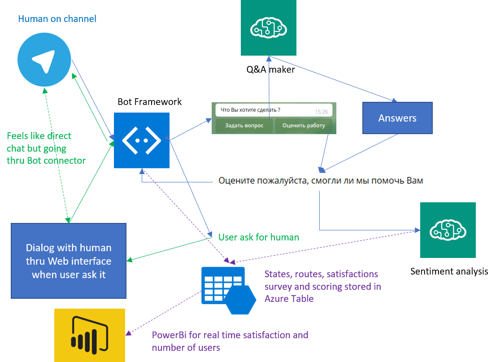
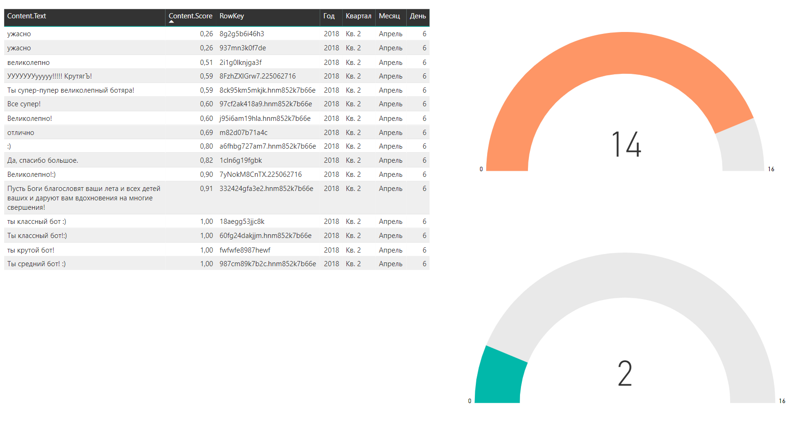

# MTS Bot
This bot is an prototype build during a 3 days hackfest. The purpose of this bot is to be able to integrate Q&A, pass over to a human for dialog as well as measure satisfaction. The project has been done in both C# and Node.js.

## The project team
This project took place in Moscow April 4-6. The team who worked on the project is:
* [Andrey Denisov](https://github.com/vagabondan), Technical Team Lead, [MTS](http://www.mts.ru/) 
* [Boris Sadovskiy](https://github.com/borisls), Developper Engineer, [MTS](http://www.mts.ru/)
* [Marat Sabirov](https://github.com/corish), System Administrator, [MTS](http://www.mts.ru/)
* [Yana Valieva](https://github.com/vJenny), Software Engineer, Microsoft, Commercial Software Engineering
* [Laurent Ellerbach](https://github.com/Ellerbach), Technical Evangelist Lead, Microsoft, Commercial Software Engineering

## Goal of the project
The main goal of the project is to build a bot where users can ask questions related to their MTS subscription, technical issues and ask at any point to discuss with a real human. And at the end give a feedback on MTS or the service, help they just get. 

We decided to build 2 prototypes, one in C# (this one), one in [Node.js](https://github.com/vagabondan/botproject.js). The final choice will be done later and it was important to see how technically both solutions were doable and how to implement both.

## Overall architecture
The overall architecture looks like the following graph:



The [Microsoft Bot Framework](https://dev.botframework.com/) has been used for both implementations. We've been using the [Q&A Maker](https://qnamaker.ai/) service for all the Q&A. And [Microsoft Cognitive Services](https://azure.microsoft.com/en-us/services/cognitive-services/text-analytics/) for the sentiment analysis. Other services like [Azure Storage](https://docs.microsoft.com/en-us/azure/storage/) are used as well to store the Bot states as well as the sentences and sentiment out of them.

## Q&A Maker
Using [Q&A Maker](https://qnamaker.ai/) service is quite straigh forward. The service can be used with any language. In our case, all the questions and answers were in Russian. MTS is a Russian company serving Russian customers. 

The way Q&A Maker is implemented as a service makes it language independant. Once you create a service in Q&A maker, you can import a tsv file or give a URL. Once created, you have 2 keys you need to use late on, the Id and the Key. Note them because you'll have to use them in the code.

The keys are used to call the REST API. The usage is quite simple. Here is an extract of the code:

```C#
public virtual async Task MessageReceivedAsync(IDialogContext context, IAwaitable<IMessageActivity> item)
{
    var message = await item;
    {
        string kbId = ConfigurationManager.AppSettings["QnaMaker.KbId"];
        string kbKey = ConfigurationManager.AppSettings["QnaMaker.KbKey"];
        string qnaUrl =
            $"https://westus.api.cognitive.microsoft.com/qnamaker/v2.0/knowledgebases/{kbId}/generateAnswer";
        HttpClient client = new HttpClient();        
        var json = new
        {
            question = strtosend,
            top = 3
        };
        var content = new StringContent(JsonConvert.SerializeObject(json), Encoding.UTF8, "application/json");
        content.Headers.Add("Ocp-Apim-Subscription-Key", kbKey);
        HttpResponseMessage response = await client.PostAsync(qnaUrl, content);
        if (response.StatusCode == HttpStatusCode.OK)
        {
            //do what needs to be done to select the answer and propose it
        }
    }
}
```
The API is very simple and [documented here](https://westus.dev.cognitive.microsoft.com/docs/services/58994a073d9e04097c7ba6fe/operations/58994a073d9e041ad42d9baa). We're only using one of the API which will return 3 possible answers maximum for a specific question. 

## Microsoft Cognitive Services
Rather than asking the user with a 1 to 5 scale or equivalent about this experience, we wanted to have it as natural as possible. So idea is to ask a question like: "Can you tell me about your experience today?" and just have the user typing whatever he wants to say.

The sentence is in Russian as customers are Russian. [Microsoft Cognitive Services](https://azure.microsoft.com/en-us/services/cognitive-services/text-analytics/) text analysis offers a service for sentiment analysis in [Russian and many other languages](https://docs.microsoft.com/en-us/azure/cognitive-services/text-analytics/text-analytics-supported-languages). Usage is very simple thru a REST API. Documentation can be found [here](https://docs.microsoft.com/en-us/azure/cognitive-services/text-analytics/). Development language support is wide with packages existing for C#, Java, Node, Python, PHP, Ruby. And if your language is not in the list, you can always use the REST API.

After few click in your Azure subscription, you can create the service and get the keys to access the service. 

The code bellow illustrate how to get a sentiment from a sentence and forcing the detection of the language to Russian. A score between 0 and 1 is returned. 0 is very negative and 1 very positive. 0.5 is neutral.

```C#
public static double MakeAnalysisRequest(string message)
{
    // Create a client.
    ITextAnalyticsAPI client = new TextAnalyticsAPI
    {
        AzureRegion = AzureRegions.Westcentralus,
        SubscriptionKey = Properties.Resources.TextApiSubscriptionKey
    };

    // Extracting sentiment
    SentimentBatchResult result = client.Sentiment(
            new MultiLanguageBatchInput(
                new List<MultiLanguageInput>()
                {
                new MultiLanguageInput("ru", "0", message),
                }));
    var score = result.Documents[0].Score;
    return score.HasValue ? score.Value : 0;    
}
```
Later in the code, the data are stored in an Azure table. The code bellow call the function above and store the result in a table. The answer is changed depending how the customer was satisfied.

```C#
private async Task MessageReceivedAsync(IDialogContext context, IAwaitable<object> result)
{
    var activity = await result as IMessageActivity;
    double feedbackScore = TextAnalyzer.MakeAnalysisRequest(activity.Text);
    String clientResponse = String.Format("Ваш отзыв был оценен как положительный на {0}%.\n{1}",
        Math.Round(feedbackScore * 100),
        (feedbackScore >= 0.5) ?
        "Спасибо, мы будем работать для Вас еще лучше !" :
        "Извините, мы постараемся работать для Вас лучше !");
    
    // ---------------------------------------------------------------
    // Save customer's reply to Azure Storage Tables
    // ---------------------------------------------------------------
    CloudStorageAccount storageAccount = CloudStorageAccount.Parse(ConfigurationManager.AppSettings["StorageConnectionString"]);

    CloudTableClient tableClient = storageAccount.CreateCloudTableClient();
    CloudTable table = tableClient.GetTableReference("CustomerFeedback");
    table.CreateIfNotExists();

    CustomerFeedback custFeedback = new CustomerFeedback(activity.ChannelId, activity.Id);
    custFeedback.Locale = activity.Locale;
    custFeedback.Text = activity.Text;
    custFeedback.Score = feedbackScore;

    TableOperation insertOperation = TableOperation.Insert(custFeedback);
    await table.ExecuteAsync(insertOperation);

    await context.PostAsync(clientResponse);
    context.Done(true);
}
```
Storing the result in an Azure table requires very little efforts. A table called "CustomerFeedback" is created. The ChannelId and the Id are used for the table keys and partitions. 

A PowerBi dashboard has been built to monitor the results in real time. It's a simple example of integration. It is possible to add as well number of users connected to the bot for example.



## Human handoff
This is the most complicated part to implement in the solution. The way to do it is basically to have the Bot Framework redirecting messages from the User to a real human rather than to the code of the bot. 

We've been using the implementations of the [intermediator bot in C#](https://github.com/tompaana/intermediator-bot-sample) and [Bot handoff in Node.js](https://github.com/palindromed/Bot-HandOff). Both solutions 

Please refer to the original GitHub readme to implement them. It is more than strongly recommended to *read very carefully* as there are many steps to do to make it happening. If you miss one step, it may not work at the end.

On the C# code, if you want to have your service working, you'll need to slightly modify the global.asx file for the table storage initialization. If you're using the original code, the routing won't be done correctly. 

```C#
protected void Application_Start()
{


    BotSettings botSettings = new BotSettings();
    string connectionString = botSettings[BotSettings.KeyRoutingDataStorageConnectionString];
    Conversation.UpdateContainer(
        builder =>
        {
            builder.RegisterModule(new AzureModule(Assembly.GetExecutingAssembly()));

            if (string.IsNullOrEmpty(connectionString))
            {
                // Default store: volatile in-memory store - Only for prototyping!
                System.Diagnostics.Debug.WriteLine("WARNING!!! Using InMemoryDataStore, which should be only used for prototyping, for the bot state!");
                var botDataStore = new InMemoryDataStore();
                builder.Register(c => botDataStore)
                    .Keyed<IBotDataStore<BotData>>(AzureModule.Key_DataStore)
                    .AsSelf()
                    .SingleInstance();
            }
            else
            {
                // Azure Table Storage
                System.Diagnostics.Debug.WriteLine("Using Azure Table Storage for the bot state");
                var store = new TableBotDataStore(connectionString);

                //botDataStore = new TableBotDataStore(connectionString);
                builder.Register(c => store)
                    .Keyed<IBotDataStore<BotData>>(AzureModule.Key_DataStore)
                    .AsSelf()
                    .SingleInstance();
            }
        });
    GlobalConfiguration.Configure(WebApiConfig.Register);
}
```

In this example, we let the basic implementation with the command "human" to have the bot working. It is of course possible to localize it to anything or put in place a button for example. As we were focussing on the prototype, the all up text from the human interaction is in English language but it is easilly localizable thru the resource file. In general, it is a good practice to use resource files and not hard code the text in your projects. The original code fom the [intermediator bot in C#](https://github.com/tompaana/intermediator-bot-sample) does include resource file in French as well.

## Conclusion
Those 2 projects in C# and Node.js were a great opportunity to implement multiple services in a single bot, comparing the approach of both SDK. In both cases, there is no blocker to use any of the technology. The Bot Framework provides a real flexible environment to implement complex scenarios.

It is noticable as well that implementing any of the Microsoft Cognitive Services is a mater of minutes and hour to implement fully in any code. The flexibility and ease of use of the services is very valuable for a developer.
